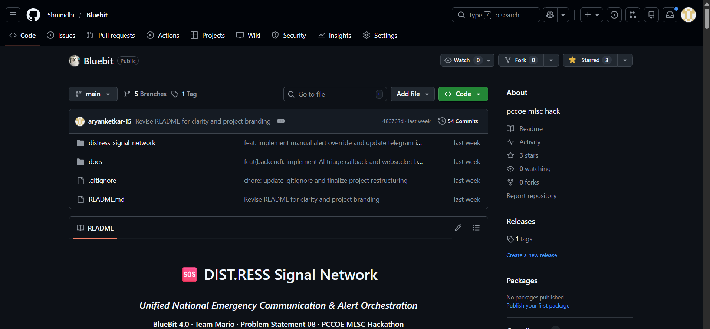

# 🚨 DIST.RESS Backend — Emergency Signal Network

This is the high-performance Node.js backend for the **Distress Signal Network**. It handles real-time SOS ingestion, NLP-based threat triage, and automated emergency broadcasts via WebSockets and Redis.

---

## 🛠️ Setup Instructions

### 1. Prerequisites
- **Node.js**: v20 or higher
- **PostgreSQL**: Local or Railway managed
- **Redis**: Local or Railway managed

### 2. Environment Configuration
The backend requires several environment variables to function correctly. **Never commit your `.env` file.**

1. Copy the example environment file:
   ```bash
   cp .env.example .env
   ```
2. Open `.env` and fill in your actual credentials (database URL, Redis URL, etc.).

### 3. Install Dependencies
```bash
npm install
```

---

## 🚀 Running the Server

### Local Development
Starts the server with `nodemon` for automatic reloading on code changes:
```bash
npm run dev
```
*Default Port: `3001`*

### Exposing to the Internet (Ngrok)
To allow the frontend and mobile devices to reach your local server, start a tunnel:
```bash
ngrok http 3001
```
*Get your public URL from the ngrok interface (e.g., `https://xxxx.ngrok-free.app`).*

### Production Start
```bash
npm start
```

---

## 🧪 Database & Demo Commands

### Run Migrations
Creates the necessary tables (`sos_reports`, `alerts`, `resources`) in your database.
```bash
npm run migrate
```

### Seed Demo Data (Pune Earthquake)
Wipes existing demo data and inserts 25 geofenced SOS reports clustered around Pune.
```bash
npm run seed
```

---

## 🛰️ API Quick Reference

| Method | Endpoint | Description |
| :--- | :--- | :--- |
| `GET` | `/health` | System health & DB/Redis connectivity |
| `POST` | `/api/sos` | Ingest new SOS distress signal |
| `GET` | `/api/sos/heatmap` | Get all active SOS coordinates |
| `POST` | `/api/alert/trigger` | Trigger NLP-confirmed emergency broadcast |
| `GET` | `/api/alerts/recent` | History of confirmed threats |

---

## 📡 WebSocket Events (Socket.io)

| Event | Direction | Payload |
| :--- | :--- | :--- |
| `new-sos` | Server -> Client | Data for a new incoming SOS |
| `triage-complete` | Server -> Client | Updated severity levels |
| `broadcast-alert` | Server -> Client | High-confidence emergency alerts |

---

Built for **BlueBit Hackathon 2026**. 🏆
